欢迎来到Mermaid的奇妙世界！🎨

想象一下，你可以用简单的文本代码就能创建出专业级的流程图、时序图、甘特图等各种图表。不需要复杂的画图软件，不需要拖拽鼠标，只需要几行代码就能让你的文档瞬间生动起来！

Mermaid让复杂的图表绘制变得简单有趣，而且完美集成到Markdown中。让我们一起探索这个神奇的工具吧！

<!-- more -->

## 🚀 什么是Mermaid？

Mermaid是一个基于JavaScript的图表绘制工具，它让你能够：

- **用代码创建图表**：告别复杂的画图软件
- **完美集成Markdown**：在文档中直接嵌入图表
- **多种图表类型**：流程图、时序图、甘特图、类图等
- **响应式设计**：自动适配不同屏幕尺寸
- **版本控制友好**：纯文本格式，Git追踪无压力

## 🎯 支持的图表类型

在深入语法之前，让我们先看看Mermaid能创建哪些精美的图表：

### 📊 流程图 (Flowchart)
展示流程和决策逻辑

### 📈 时序图 (Sequence Diagram)
显示对象间的交互过程

### 📅 甘特图 (Gantt Chart)
项目进度和时间规划

### 🏗️ 类图 (Class Diagram)
面向对象设计的可视化

### 🌳 Git图 (Git Graph)
展示Git分支和提交历史

### 🥧 饼图 (Pie Chart)
数据占比的可视化

### 🗺️ 用户旅程图 (User Journey)
用户体验流程分析

## 📝 基础语法

### 流程图 - 最常用的图表类型

流程图是Mermaid最强大的功能之一，让我们从简单的开始：

**代码示例：**
```
graph TD
    A[开始] --> B{是否登录?}
    B -->|是| C[显示主页]
    B -->|否| D[跳转登录页]
    C --> E[结束]
    D --> F[用户登录]
    F --> C
```

**渲染效果：**
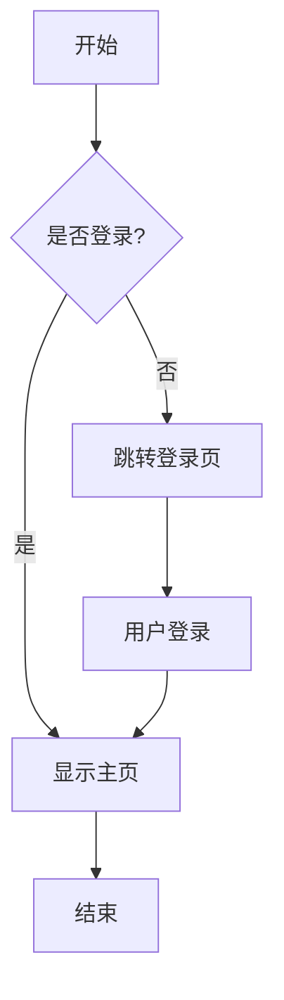

**语法解释：**
- `graph TD`：创建从上到下的流程图
- `A[开始]`：矩形节点
- `B{是否登录?}`：菱形决策节点
- `-->`：箭头连接
- `-->|文字|`：带标签的箭头

#### 节点形状大全

**代码示例：**
```
graph LR
    A[矩形] --> B(圆角矩形)
    B --> C{菱形}
    C --> D((圆形))
    D --> E>右向标签]
    E --> F[[子程序]]
    F --> G[(数据库)]
    G --> H[/平行四边形/]
    H --> I[\梯形\]
```

**渲染效果：**
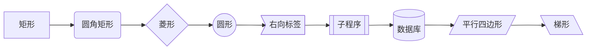

#### 连接线类型

**代码示例：**
```
graph TD
    A --> B
    A --- C
    A -.-> D
    A ==> E
    A --o F
    A --x G
```

**渲染效果：**
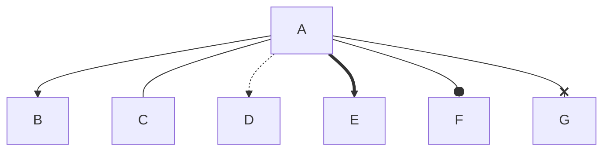

**连接线说明：**
- `-->` 实线箭头
- `---` 实线
- `-.->` 虚线箭头
- `==>` 粗线箭头
- `--o` 实线圆圈
- `--x` 实线叉号

### 时序图 - 展示交互过程

时序图非常适合展示系统间的交互：

**代码示例：**
```
sequenceDiagram
    participant U as 用户
    participant F as 前端
    participant B as 后端
    participant D as 数据库

    U->>F: 提交登录表单
    F->>B: 发送登录请求
    B->>D: 验证用户信息
    D-->>B: 返回验证结果
    B-->>F: 返回登录状态
    F-->>U: 显示登录结果

    Note over U,F: 用户看到结果
    alt 登录成功
        F->>U: 跳转到主页
    else 登录失败
        F->>U: 显示错误信息
    end
```

**渲染效果：**
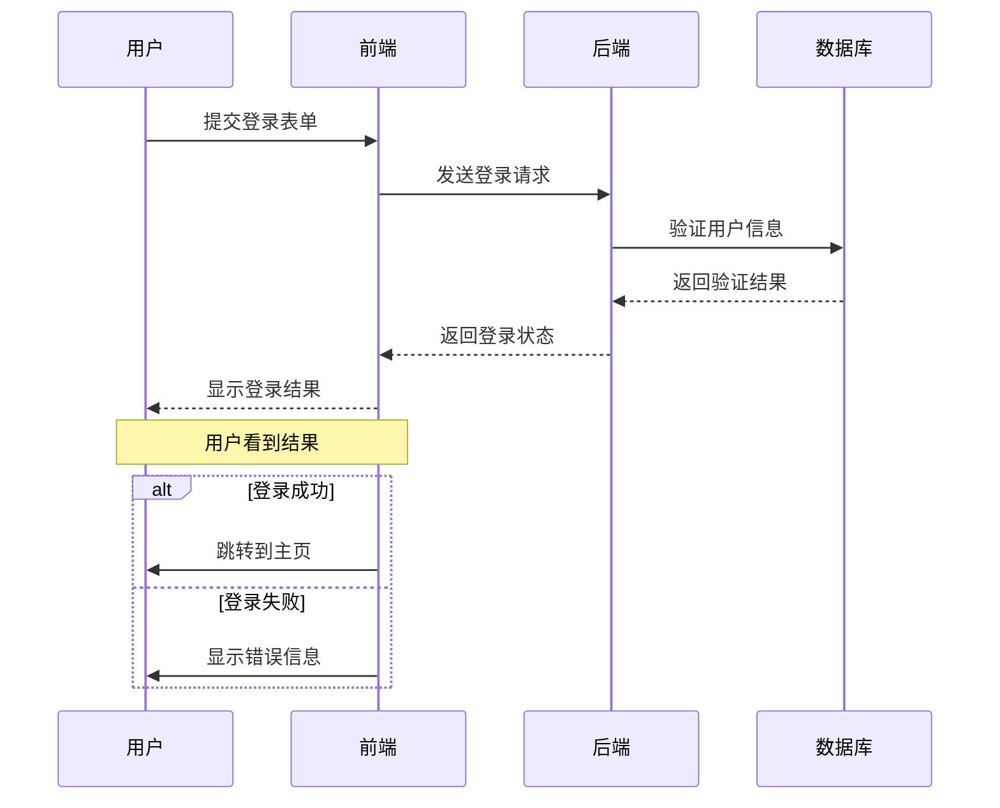

**语法要点：**
- `participant` 定义参与者
- `->>` 实线箭头
- `-->>` 虚线箭头
- `Note over` 添加注释
- `alt/else/end` 条件分支

### 甘特图 - 项目管理神器

**代码示例：**
```
gantt
    title 网站开发项目计划
    dateFormat  YYYY-MM-DD
    section 设计阶段
    需求分析           :done,    des1, 2025-01-01, 2025-01-05
    UI设计             :done,    des2, 2025-01-06, 2025-01-15
    原型制作           :active,  des3, 2025-01-16, 2025-01-20
    section 开发阶段
    前端开发           :         dev1, 2025-01-21, 2025-02-15
    后端开发           :         dev2, 2025-01-21, 2025-02-10
    数据库设计         :         dev3, 2025-01-21, 2025-01-25
    section 测试阶段
    单元测试           :         test1, 2025-02-11, 2025-02-18
    集成测试           :         test2, 2025-02-16, 2025-02-22
    用户验收测试       :         test3, 2025-02-19, 2025-02-25
```

**渲染效果：**
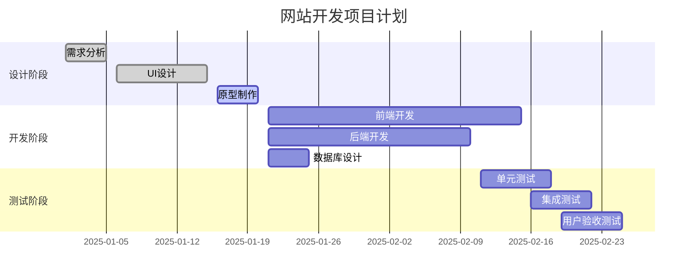

### 类图 - 面向对象设计

**代码示例：**
```
classDiagram
    class User {
        +String name
        +String email
        +String password
        +login()
        +logout()
        +updateProfile()
    }

    class Post {
        +String title
        +String content
        +Date createdAt
        +User author
        +publish()
        +update()
        +delete()
    }

    class Comment {
        +String content
        +Date createdAt
        +User author
        +Post post
        +reply()
        +edit()
    }

    User --> Post : creates
    Post --> Comment : contains
    User --> Comment : writes
```

**渲染效果：**
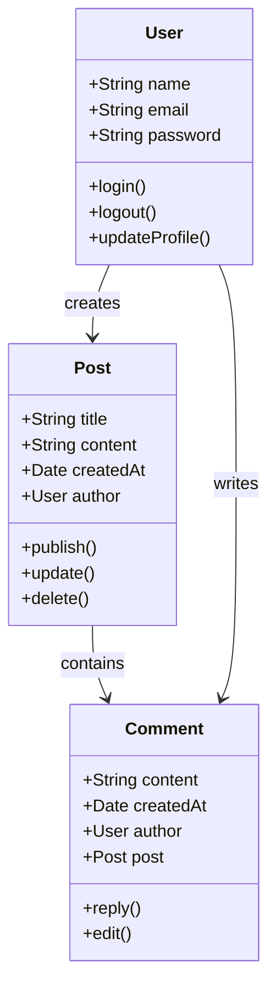

### 饼图 - 数据可视化

**代码示例：**
```
pie title 编程语言使用情况
    "JavaScript" : 35
    "Python" : 25
    "Java" : 20
    "TypeScript" : 15
    "其他" : 5
```

**渲染效果：**
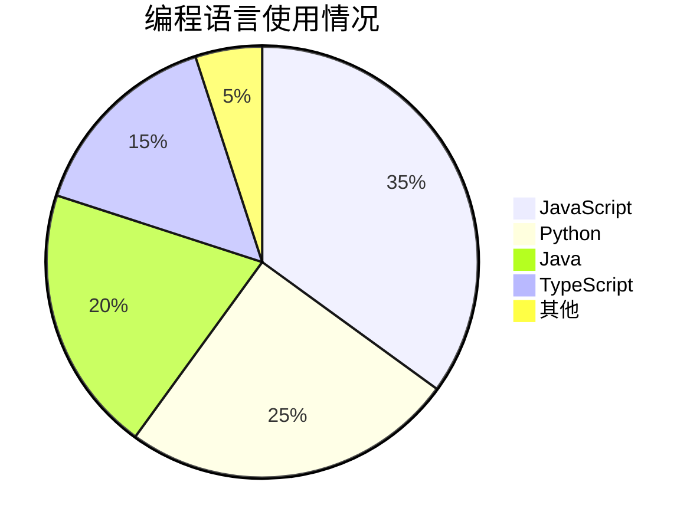

### Git工作流程图 - 版本控制可视化

**代码示例：**
```
graph TD
    A[初始提交] --> B[添加登录功能]
    B --> C[main分支]

    B --> D[创建develop分支]
    D --> E[开发新功能]
    E --> F[修复bug]

    F --> G[创建feature分支]
    G --> H[实现支付功能]
    H --> I[测试支付功能]

    I --> J[合并到develop]
    F --> J
    J --> K[合并支付功能]

    K --> L[合并到main]
    C --> L
    L --> M[发布v1.0]

    classDef mainBranch fill:#ff6b6b,stroke:#d63031,stroke-width:3px
    classDef developBranch fill:#4ecdc4,stroke:#00b894,stroke-width:2px
    classDef featureBranch fill:#ffeaa7,stroke:#fdcb6e,stroke-width:2px
    classDef mergeBranch fill:#a29bfe,stroke:#6c5ce7,stroke-width:2px

    class A,B,C,L,M mainBranch
    class D,E,F,J,K developBranch
    class G,H,I featureBranch
```

**渲染效果：**
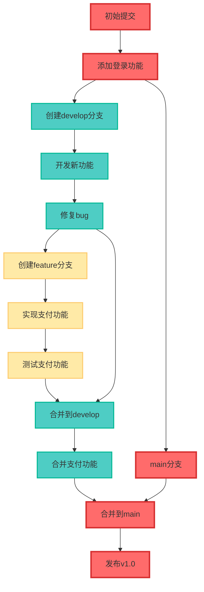

## 🎨 样式定制

### 主题选择

Mermaid提供了多种内置主题：

**代码示例：**
```
%%{init: {'theme':'dark'}}%%
graph TD
    A[开始] --> B{检查}
    B -->|通过| C[继续]
    B -->|失败| D[重试]
    D --> B
    C --> E[结束]
```

**渲染效果：**
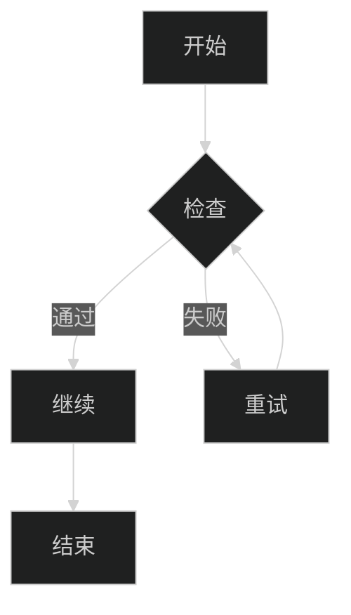

可用主题：
- `default` - 默认主题
- `dark` - 深色主题
- `forest` - 森林主题
- `neutral` - 中性主题

### 自定义样式

**代码示例：**
```
graph TD
    A[开始]:::startClass --> B{决策}
    B -->|是| C[处理]:::processClass
    B -->|否| D[结束]:::endClass
    C --> D

    classDef startClass fill:#e1f5fe,stroke:#01579b,stroke-width:2px
    classDef processClass fill:#f3e5f5,stroke:#4a148c,stroke-width:2px
    classDef endClass fill:#e8f5e8,stroke:#1b5e20,stroke-width:2px
```

**渲染效果：**
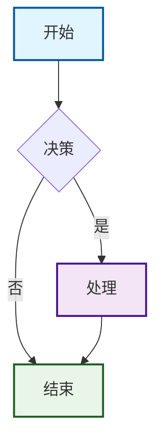

## 🛠️ 实用技巧

### 1. 复杂流程图的组织

**代码示例：**
```
graph TB
    subgraph "用户认证"
        A[用户登录] --> B{验证信息}
        B -->|成功| C[生成Token]
        B -->|失败| D[返回错误]
    end

    subgraph "业务逻辑"
        C --> E[获取用户信息]
        E --> F[处理业务请求]
        F --> G[返回结果]
    end

    subgraph "异常处理"
        D --> H[记录日志]
        H --> I[返回错误码]
    end
```

**渲染效果：**
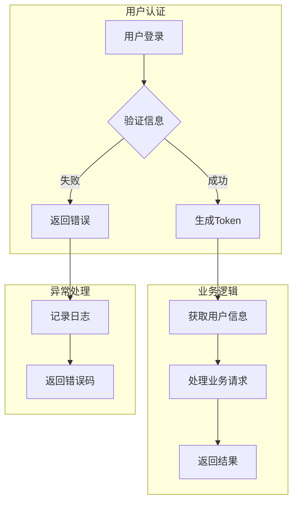

### 2. 时序图的高级用法

**代码示例：**
```
sequenceDiagram
    participant A as 客户端
    participant B as API网关
    participant C as 用户服务
    participant D as 订单服务

    A->>+B: 请求下单
    B->>+C: 验证用户
    C-->>-B: 用户有效
    B->>+D: 创建订单
    D-->>-B: 订单创建成功
    B-->>-A: 返回订单信息

    rect rgb(255, 255, 0)
        Note over A,D: 这是关键流程
    end
```

**渲染效果：**
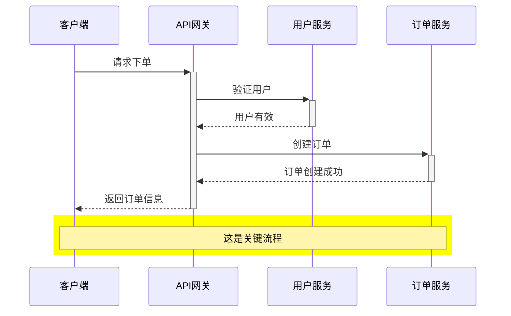

### 3. 甘特图的最佳实践

**代码示例：**
```
gantt
    title 敏捷开发迭代计划
    dateFormat  YYYY-MM-DD
    axisFormat  %m-%d

    section Sprint 1
    需求梳理    :milestone, m1, 2025-01-27, 0d
    开发任务1   :a1, 2025-01-27, 7d
    开发任务2   :a2, 2025-01-27, 5d
    测试任务    :after a1 a2, 3d

    section Sprint 2
    开发任务3   :b1, 2025-02-10, 7d
    开发任务4   :b2, 2025-02-10, 5d
    集成测试    :after b1 b2, 3d

    section 发布
    部署准备    :c1, 2025-02-24, 2d
    生产发布    :milestone, m2, 2025-02-26, 0d
```

**渲染效果：**
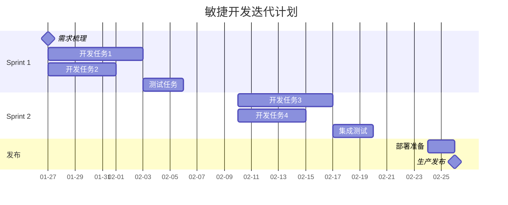

## 🎯 最佳实践

### 1. 保持图表简洁
- 避免过于复杂的图表
- 使用子图组织相关内容
- 适当使用颜色区分不同类型的节点

### 2. 命名规范

**代码示例：**
```
graph TD
    userLogin[用户登录] --> validateAuth{验证身份}
    validateAuth -->|成功| showDashboard[显示仪表板]
    validateAuth -->|失败| showError[显示错误]
```

**渲染效果：**
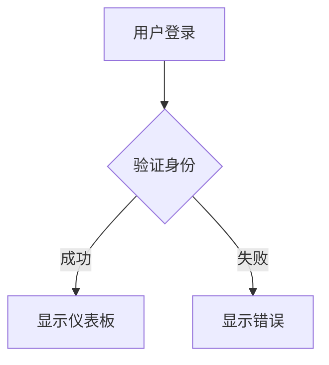

### 3. 注释和文档

**代码示例：**
```
graph TD
    %% 这是注释，不会显示在图表中
    A[开始] --> B[处理]
    B --> C[结束]

    %% 添加样式
    classDef highlight fill:#ffeb3b,stroke:#f57f17,stroke-width:3px
    class A,C highlight
```

**渲染效果：**
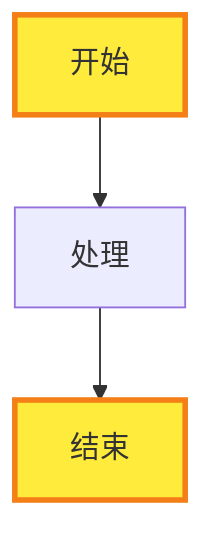

### 4. 响应式设计
- 考虑不同屏幕尺寸的显示效果
- 避免过长的文本标签
- 使用合适的图表方向

## 🔧 工具和平台

### 在线编辑器
- **Mermaid Live Editor** - 官方在线编辑器
- **Draw.io** - 支持Mermaid语法
- **Notion** - 内置Mermaid支持

### 开发工具集成
- **VS Code** - Mermaid Preview插件
- **Typora** - 原生支持Mermaid
- **GitBook** - 完美集成
- **GitHub** - 原生支持在README中使用

### 博客平台
- **Hexo** - 通过插件支持
- **VuePress** - 原生支持
- **GitLab Pages** - 内置支持
- **Netlify** - 构建时渲染

## 🚀 实际应用场景

### 1. 技术文档

**代码示例：**
```
graph TD
    A[系统架构图] --> B[数据流图]
    B --> C[部署流程图]
    C --> D[API交互图]
```

**渲染效果：**
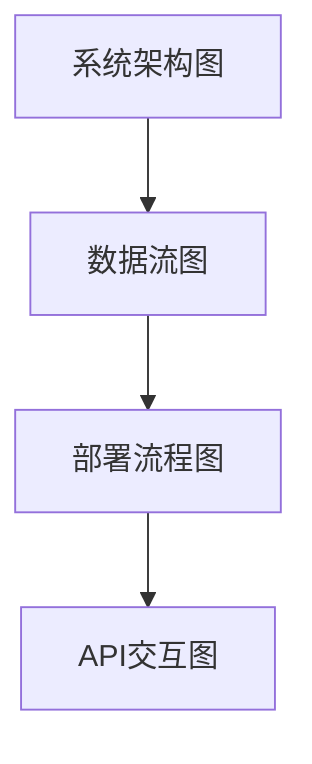

### 2. 项目管理

**代码示例：**
```
graph LR
    A[项目启动] --> B[需求分析]
    B --> C[设计开发]
    C --> D[测试部署]
    D --> E[项目交付]
```

**渲染效果：**
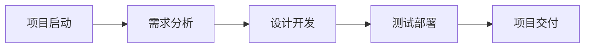

### 3. 业务流程

**代码示例：**
```
graph TD
    A[客户咨询] --> B{需求评估}
    B -->|复杂| C[技术方案]
    B -->|简单| D[标准方案]
    C --> E[报价审批]
    D --> E
    E --> F[签订合同]
```

**渲染效果：**
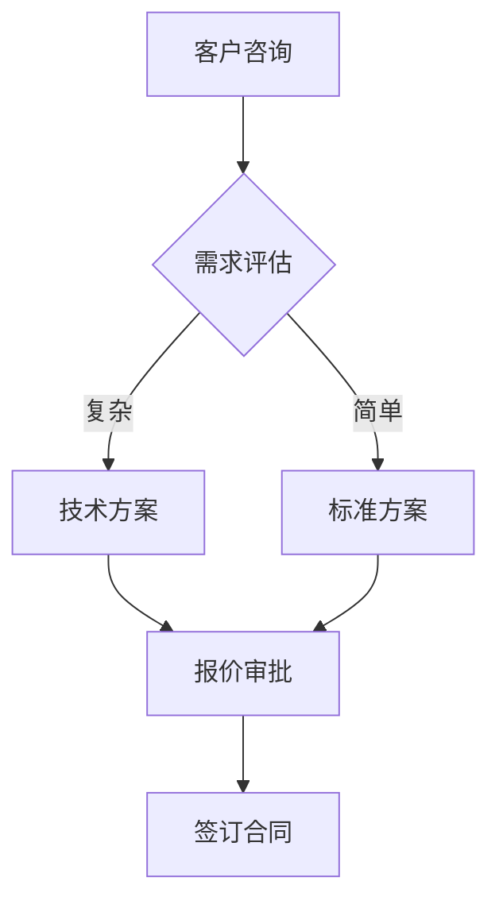

## 📚 进阶学习

### 1. 复杂图表组合
学会将多种图表类型组合使用，创建更丰富的文档。

### 2. 自定义主题
深入了解CSS样式，创建符合品牌的自定义主题。

### 3. 集成开发
学习如何在项目中集成Mermaid，实现动态图表生成。

### 4. 性能优化
了解大型图表的渲染优化技巧。

## 🎉 总结

Mermaid是一个强大而优雅的图表绘制工具，它让复杂的可视化变得简单有趣。通过这份指南，你已经掌握了：

✅ **基础语法**：各种图表类型的创建方法
✅ **样式定制**：让图表更美观更专业
✅ **实用技巧**：提高图表质量的方法
✅ **最佳实践**：避免常见问题的经验
✅ **工具集成**：在各种平台中使用Mermaid

现在就开始你的Mermaid之旅吧！从简单的流程图开始，逐步探索更复杂的图表类型。记住，最好的学习方法就是动手实践。

---

💡 **小贴士**：本文中的所有图表都可以直接复制使用，建议先从简单的例子开始练习。

🔗 **相关资源**：
- [Mermaid官方文档](https://mermaid.js.org/)
- [Mermaid Live Editor](https://mermaid.live/)
- [思米米的博客](https://simimi.cn)

Happy Charting! 🎨✨
